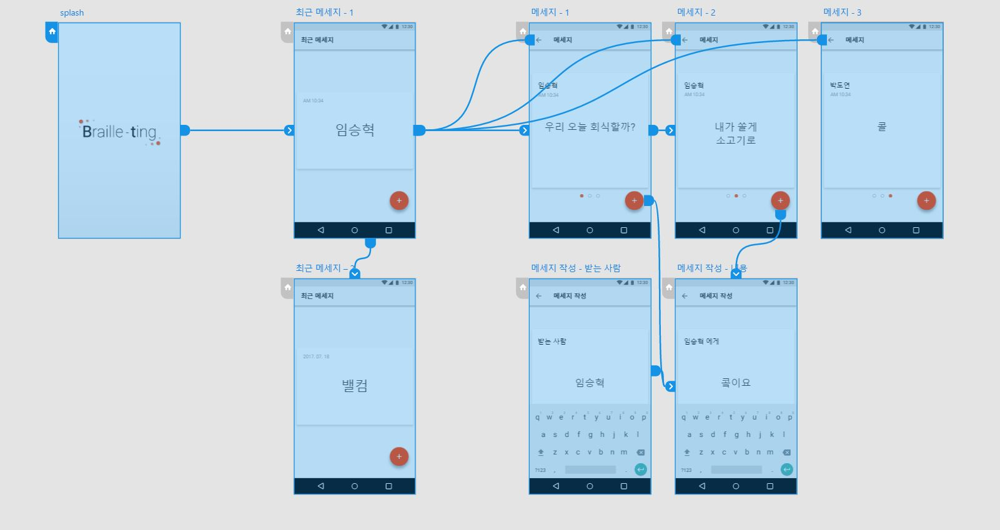

# Braille-ting

모바일 콘텐츠 공모전 출품작 생활분야 "Braille-ting"입니다.

##GUIDE

## FILE

* `AI`: 디자인 원본 ai파일 입니다.
* `resource`: 디자인 리소스 파일이 들어 있습니다.
* `screenshot`: 디자인 전체 화면입니다.
* `braille-ting.xd`: Adobe Experience Design CC(Beta) 를 사용한 UI/UX 디자인 파일 입니다.

## Resource

* `splash.png`: 스플레시 화면 입니다.
* `ic_logo.png`: 앱의 아이콘 입니다.
* `title.png`: 앱의 로고 타이틀 입니다.
* `btn_add`: 플로팅 액션 버튼 입니다.

## COLOR

* `#FAFAFA`: 앱의 배경 색 입니다.
* `#F5F5F5`: 스테이터스 바의 색 입니다.
* `#E0E0E0`: 네비게이션 바의 색 입니다.
* `#FF3D00`: 악센트 색 입니다.

